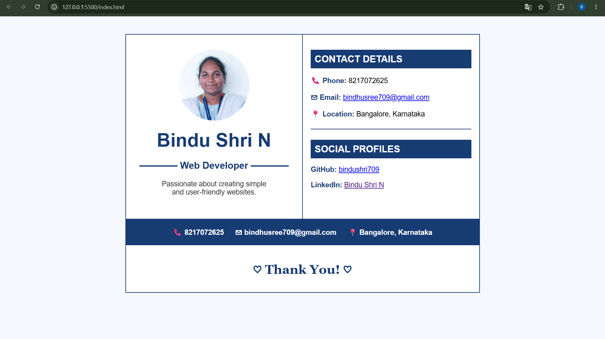
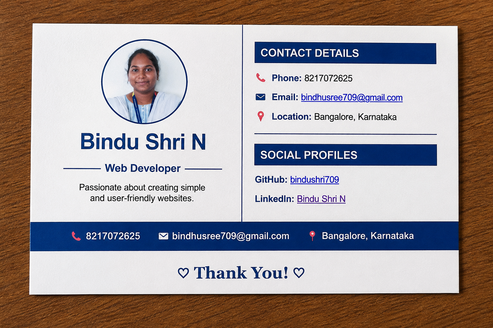

# Bindu Shri N - Visiting Card

A personal visiting card created using HTML as part of a web development assignment.

## Before Printing

This is how the visiting card looks on the webpage before printing.

## After Printing

This is how the visiting card looks as a physical printed visiting card.

## About the Project

This project is a personal visiting card for Bindu Shri N, a Web Developer.

The visiting card contains:

- Profile photo
- Name and designation
- Phone number
- Email address
- Location
- GitHub profile
- LinkedIn profile

## Technologies Used

- HTML

## Features

- Simple and professional visiting card design
- Round profile photo
- Clickable email address
- Clickable GitHub profile
- Clickable LinkedIn profile
- HTML-only implementation

## Author

**Bindu Shri N**

Web Developer